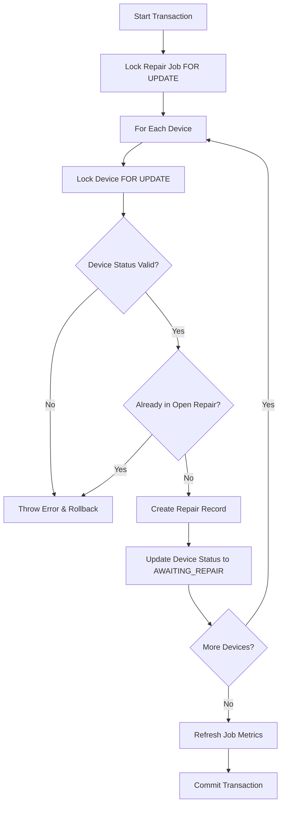
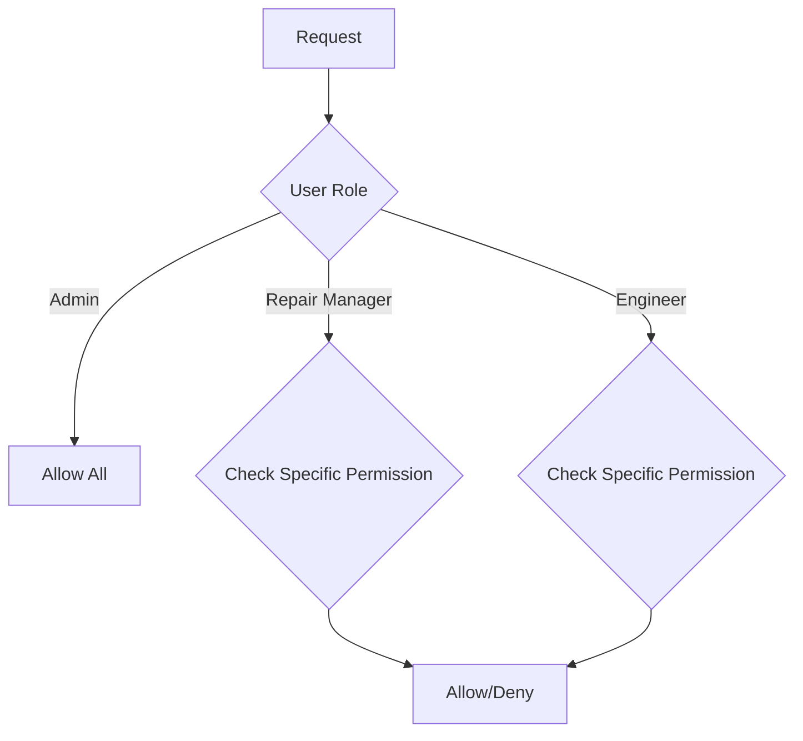

# Repair Module - Remediation Plan

## Overview

This document outlines a comprehensive plan to address all issues identified in the code review of the Repair Module. Issues are prioritized by severity and organized into executable phases.

---

## Phase 1: CRITICAL - Data Integrity & Race Conditions

### 1.1 Fix Race Condition in Add Devices Loop
**File:** `server/src/controllers/repairController.js`
**Location:** Lines 451-491 (`addDevicesToRepairJob` function)

**Problem:** Sequential device processing allows concurrent additions of the same device to multiple jobs without proper locking.

**Solution:**
1. Acquire `FOR UPDATE` lock on each device BEFORE checking eligibility
2. Re-validate device status within the transaction (not just at query time)
3. Add status check for shipped/scrapped/returned/out_of_stock states



**Implementation Steps:**
1. Modify the for-loop to acquire lock on each device individually
2. Add explicit status validation within the loop
3. Check `repair_required` flag consistency before allowing addition
4. Test concurrent device addition scenarios

---

### 1.2 Fix Race Condition in Job Number Generation
**File:** `server/src/models/repairModel.js`
**Location:** Lines 377-384 (`getNextJobNumber` function)

**Problem:** `MAX(job_number)` read then generate is not atomic - concurrent requests could get duplicate numbers.

**Solution Options:**

**Option A: Database Auto-Increment (Recommended)**
- Add new column `job_sequence` with AUTO_INCREMENT
- Generate job number in trigger or application after insert

**Option B: Table-Level Lock**
- Use `GET_LOCK()` and `RELEASE_LOCK()` MySQL functions
- Serialize job number generation

**Option C: Insert-Then-Update**
- Insert with NULL/number, let DB generate
- Update with calculated number after insert

**Implementation Steps:**
1. Create database migration for sequence table or auto-increment column
2. Modify `getNextJobNumber()` to use atomic approach
3. Add unique constraint on `job_number` column as safety net
4. Implement retry logic if duplicate key error occurs

---

### 1.3 Add Part Quantity Validation (Prevent Negative Stock)
**Files:** `server/src/models/partModel.js`, Database Schema

**Problem:** No database-level protection against negative part quantities.

**Solution:**
1. Add CHECK constraints on part_lots and parts tables
2. Add validation in update functions before applying deltas

```sql
-- Example CHECK constraint (MySQL 8.0.16+)
ALTER TABLE part_lots 
ADD CONSTRAINT chk_available_quantity_positive 
CHECK (available_quantity >= 0);

ALTER TABLE parts 
ADD CONSTRAINT chk_part_available_positive 
CHECK (available_quantity >= 0);
```

**Implementation Steps:**
1. Create database migration to add CHECK constraints
2. Add pre-condition validation in `updateLotQuantities()` 
3. Add pre-condition validation in `updatePartQuantities()`
4. Return explicit error if update would cause negative quantity

---

## Phase 2: HIGH Priority - Security & Authorization

### 2.1 Implement Role-Based Access Control (RBAC)
**File:** `server/src/middleware/auth.js` (create new middleware)
**Files:** All repair route handlers

**Problem:** Any authenticated user can perform any repair action.

**Solution:**
1. Define permission constants
2. Create authorization middleware
3. Apply to repair routes



**Implementation Steps:**
1. Define permissions: `REPAIR_CREATE`, `REPAIR_COMPLETE`, `PART_RESERVE`, `PART_FIT`, `JOB_CANCEL`
2. Create `authorize(permission)` middleware
3. Add role field to user model if not present
4. Apply middleware to repair routes
5. Return 403 Forbidden for unauthorized actions

---

### 2.2 Add Authorization to Repair Controllers
**Files:** `server/src/controllers/repairController.js`

**Additional Checks Needed:**
1. `createRepairJob` - Check user can create jobs for specific warehouse/supplier
2. `addDevicesToRepairJob` - Verify device belongs to user's accessible PO
3. `updateRepairRecord` - Verify engineer owns or is assigned to the repair
4. `escalateRepairToLevel3` - Only senior engineers or managers

**Implementation Steps:**
1. Add warehouse/location filter to job creation validation
2. Add check that PO supplier is in user's accessible list
3. Add audit trail for who performed each action

---

## Phase 3: MEDIUM Priority - Functional Improvements

### 3.1 Add BER Reason Capture
**Files:** 
- `server/src/models/repairModel.js` (add `ber_reason` field)
- `server/src/controllers/repairController.js` (update record with reason)
- `client/src/pages/RepairRecordDetail.jsx` (UI)
- `client/src/schemas/repair.js` (validation)

**Problem:** BER (Beyond Economic Repair) flow doesn't capture reason.

**Solution:**
1. Add `ber_reason` column to `repair_records` table
2. Make field required when status = BER
3. Add UI modal or form to capture reason before completion
4. Pass reason through API and validate

**Implementation Steps:**
1. Create migration: `ALTER TABLE repair_records ADD COLUMN ber_reason VARCHAR(500)`
2. Update `updateRepairRecordSchema` to include ber_reason
3. Modify controller to validate ber_reason when status = BER
4. Add UI component in RepairRecordDetail.jsx
5. Update history log to include BER reason

---

### 3.2 Fix Stale Device Eligibility Check
**File:** `server/src/controllers/repairController.js`
**Location:** `addDevicesToRepairJob` function

**Problem:** `getEligibleDevices()` returns stale data; status could change before submission.

**Solution:**
1. Re-validate each device's current status inside transaction
2. Add explicit checks for each forbidden status
3. Return specific error for each failure case

**Implementation Steps:**
1. Inside transaction, query current device status for each ID
2. Verify not in: SHIPPED, SCRAPPED, RETURNED, OUT_OF_STOCK
3. Verify not already in OPEN repair record (already done but re-confirm)
4. Return appropriate error message

---

### 3.3 Make Meta Endpoint Limits Configurable
**File:** `server/src/controllers/repairController.js`
**Location:** Lines 245-260 (`getRepairMeta` function)

**Problem:** Hardcoded LIMIT 200 on purchase orders and sales orders.

**Solution:**
1. Accept query parameters for limits
2. Add max limit cap (e.g., 500) to prevent abuse

**Implementation Steps:**
1. Update controller to read `limit` from query params
2. Apply Math.min() to cap at 500
3. Update client to handle pagination for dropdowns if needed

---

### 3.4 Add Device Status Transition Validation
**File:** `server/src/controllers/repairController.js`
**Location:** `addDevicesToRepairJob`, `updateRepairRecord`

**Problem:** Setting `repair_required = TRUE` blindly without checking previous state.

**Solution:**
1. Only set `repair_required = TRUE` if transitioning FROM IN_STOCK or other states
2. Don't overwrite if already TRUE (maintain audit trail)
3. Add explicit state transition matrix

**Implementation Steps:**
1. Create state transition validation function
2. Apply to all status change operations
3. Log state transitions in device_history

---

## Phase 4: LOW Priority - UI & UX Improvements

### 4.1 Add Debounce to Search Input
**File:** `client/src/pages/Repair.jsx`
**Location:** Lines 51-60

**Problem:** Search triggers API call on every keystroke.

**Solution:**
1. Add debounce hook (300ms delay)
2. Only trigger search after delay

**Implementation Steps:**
1. Import or create debounce utility
2. Apply to search input onChange handler
3. Test with rapid typing

---

### 4.2 Add Loading State Improvements
**Files:** `client/src/pages/CreateRepair.jsx`, `client/src/pages/RepairJobDetail.jsx`

**Solution:**
1. Disable entire form during submission
2. Show spinner or loading indicator
3. Disable navigation during pending mutations

---

### 4.3 Add Outcome Selection to Repair Completion
**File:** `client/src/pages/RepairRecordDetail.jsx`

**Problem:** No UI to set outcome when completing repair.

**Solution:**
1. Add dropdown with predefined outcomes
2. Pass outcome to backend
3. Update schema to validate outcome values

**Implementation Steps:**
1. Add outcome dropdown in Repair Actions section
2. Update saveRecord function to include outcome
3. Validate outcome in schema

---

## Phase 5: Testing & Verification

### 5.1 Create Integration Tests
**Test Scenarios:**
1. Concurrent device addition (race condition test)
2. Concurrent job creation (job number test)
3. Part quantity boundaries (negative test)
4. Status transition validation
5. Authorization bypass attempts

### 5.2 Create Unit Tests
**Test Coverage:**
- Job number generation
- Device eligibility validation
- Part quantity calculations
- Color change logic
- State machine transitions

### 5.3 Manual Testing Checklist
- [ ] Add same device to two jobs concurrently
- [ ] Create two jobs at same time
- [ ] Add shipped device to repair job
- [ ] Complete repair without setting outcome
- [ ] Mark device BER without reason
- [ ] Test unauthorized user access attempts
- [ ] Test search debouncing

---

## Implementation Order

```
Phase 1 (Critical - Week 1):
├── 1.1 Fix Add Devices Race Condition
├── 1.2 Fix Job Number Generation
└── 1.3 Add Quantity Validation

Phase 2 (High Priority - Week 2):
├── 2.1 Implement RBAC Middleware
└── 2.2 Add Controller Authorization Checks

Phase 3 (Medium Priority - Week 3):
├── 3.1 Add BER Reason Capture
├── 3.2 Fix Stale Eligibility Check
├── 3.3 Make Limits Configurable
└── 3.4 Status Transition Validation

Phase 4 (Low Priority - Week 4):
├── 4.1 Add Search Debounce
├── 4.2 Loading State Improvements
└── 4.3 Outcome Selection UI

Phase 5 (Testing - Ongoing):
├── 5.1 Integration Tests
├── 5.2 Unit Tests
└── 5.3 Manual Testing
```

---

## Risk Mitigation

| Risk | Mitigation |
|------|------------|
| Breaking existing functionality | Add comprehensive tests before changes |
| Database migration conflicts | Use non-blocking migrations where possible |
| Performance impact of locks | Keep lock durations minimal; index properly |
| User workflow disruption | Communicate changes; provide training |

---

## Success Criteria

1. All HIGH severity issues resolved
2. No race conditions in concurrent operations
3. Part quantities cannot go negative at DB level
4. Role-based access control implemented
5. BER reason capture working end-to-end
6. 80%+ test coverage on repair module
7. All manual test scenarios pass
